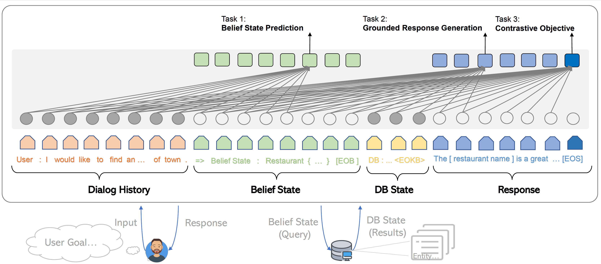

# SOLOIST - Building Task-oriented Bot at Scale

## Introduction

This repository consists of my implementation of article
[SOLOIST: Building Task Bots at Scale with Transfer Learning and Machine Teaching
](https://arxiv.org/abs/2005.05298) Baolin Peng, Chunyuan Li, Jinchao Li, Shahin Shayandeh, Lars Liden, Jianfeng Gao
*Transactions of the Association for Computational Linguistics 2021*



This is how authors describe their model:

> SOLOIST is a new pre-training-fine-tuning paradigm for building task-oritend dialog systems. We parameterize a dialog system using a Transformer-based auto-regressive language model, which subsumes different dialog modules (e.g. state tracker, dialog policy, response generator) into a single neural model. We pre-train, on large heterogeneous dialog corpora, a large-scale Transformer model which can generate dialog responses grounded in user goals and real-world knowledge for task completion. The pre-trained model can be efficiently fine-tuned and adapted to accomplish a new dialog task with a handful of task-specific dialogs via fine-tuning and machine teaching.

This repository is based on hugginface transformer and OpenAI GPT-2.

## Installation

I developed via python 3.8.13 but I think it would be compatible with other python versions, Although
I didn't check that.

Please use the below commands to clone the repo and install required package.
```
git clone https://gitlab.com/engmrgh/soloist.git
cd soloist
git submodule update --init
git lfs install
git lfs pull
pip3 install torch torchdatasets transformers==2.5.1 pytorch-ignite tensorboardX spacy
```

Because of hardware limitation I only have the opportunity to train on MultiWOZ dataset.
The dataset I used to train is included in the repo under `data` folder.

## Pipeline

**Data format**

```json
  {
    "history": [
      "user : later I have to call Jessie"
    ],
    "belief": "belief : name = Jessie",
    "kb": "",
    "reply": "system : Sure, added to your reminder list. FOLLOWUP action_set_reminder"
  },
```
We use json to represent a training example. As shown in the example, it contains the following fields:
* **history** - The context from session beginning to current turn
* **belief** - The belief state.
* **kb** - Database query results, leave it as blank if db query is not requried.
* **reply** - The target system respose. It can be a template, an api call or natural language.

**Training**

```bash
python3 train.py --n_epochs 5 \
                 --train_dataset <train_dataset_path>
                 --train_cache <train_cache_path> \
                 --val_dataset <validation_dataset_path>
                 --val_cache <validation_cache_path> \
                 --train_batch_size 2 \
                 --max_seq_length 256 \
                 --n_fake_instances 8 \
                 --device 'cuda' \
                 --model_checkpoint <Checkpoint>
```

Details of the options could be seen in the code.

**Evaluation**

```python
python3 evaluate.py --checkpoint <trained-model-checkpoint>
                    --soloist-testset <soloist-testset-path>
                    --multiwoz-testset <multiwoz-testset-path>
```

For further description of options please refer to code.
